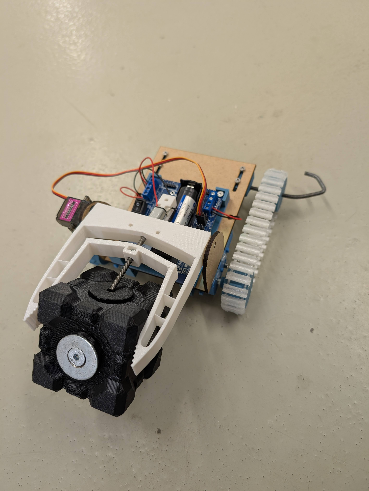

# RescueBot – Greifroboter Beispielprojekt

Dieses Repository enthält alle notwendigen Dateien und Anleitungen für den Aufbau des RescueBot, einem Beispielprojekt von TinkerThinker. Der RescueBot ist ein Greifroboter, der mit einem vorn montierten Greifer ausgestattet ist. Mit ihm lassen sich Objekte greifen und vertikal (hoch und runter) bewegen – ideal für Demonstrationen und Experimente im Bereich Robotik.

## Übersicht

Der RescueBot nutzt Kettenantrieb und eine Kombination aus verschiedenen Motoren, um sich fortzubewegen und Objekte zu greifen. Die mechanischen Komponenten werden zum Teil aus 3 mm MDF (laser geschnitten) und 3D-gedrucktem PLA hergestellt. Die Kette sowie die Abstandshalter werden aus TPU gedruckt.

## Hardware-Komponenten

- **Kleiner Getriebemotor mit M4-Gewinde** – verantwortlich für den Greifer
- **1 Servo** – steuert die Greifbewegung
- **2 Blaue Getriebemotoren** – sorgen für den Antrieb
- **Materialien:**
  - 3 mm MDF-Platten (laser geschnitten)
  - 3D-gedruckter PLA
  - TPU (für Kette und Abstandshalter)
- **Weitere Bauteile:**
  - TPU-Abstandshalter/Kette
  - Schrauben, Muttern und Heißkleber

## Ordnerstruktur und Dateien

- **RescueBot.jpg:** Ein Bild, auf dem der vollständig zusammengebaute Roboter zu sehen ist.
- **RescueBotCAD.f3d:** Die Fusion 360 CAD-Datei, die das Design des Robots beschreibt.
- **STLs:** Dieser Ordner enthält alle STL-Dateien sowie Lasercutter-Dateien, die für den Zuschnitt und 3D-Druck benötigt werden.

## Elektrische Anschlüsse

- **Anschluss D und C:** Fahrmotoren (Antrieb)
- **Anschluss A:** Greifermotor (inklusive Trommessung)
- **Anschluss 1:** Servo (für den Greifer)

## Zusammenbauanleitung

1. **Motorhalter montieren:**
   - Befestige die Motorhalter, indem du sie von unten mit Schrauben durch die MDF-Platte und den Platinenhalter fixierst.
   - Die im Platinenhalter vorhandenen Mutternaussparungen helfen beim Einschrauben.

2. **Motoren einsetzen:**
   - Montiere die Motoren und achte darauf, dass diese gerade ausgerichtet sind.
   - Verwende jeweils 3 Schrauben, die in das PLA eingeschraubt werden.

3. **Achsenhalter anbringen:**
   - Befestige die Achsenhalter in den Langlöchern.
   - Nutze die vorgesehenen Mutternhalter, um die Platine fest zu fixieren.

4. **Räder montieren:**
   - Stecke die Räder auf die Motoren. Achte darauf, dass sie nicht zu fest sitzen – halte sie gegebenenfalls beim Anbringen etwas gegen.
   - Setze die Achse in den Achsenhalter und montiere die Räder. Sollte die Passung zu eng sein, bohre die Achse leicht auf.
   - Die TPU-Abstandshalter helfen dabei, die Räder in Position zu halten.

5. **Ketten anbringen:**
   - Ziehe die TPU-gedruckte Kette auf und spanne sie mithilfe der Langlöcher.

6. **Greifer zusammenbauen:**
   - Der Greifer besitzt ein Loch für eine M4-Mutter. Stecke die Mutter ein und überprüfe, ob sie bis nach unten reicht.
   - Erwärme den Steg des Motorhalters rundherum und biege ihn nach unten.
   - Führe den Greifermotor ein und fixiere ihn durch die Mutter.
   - Erwärme den Steg erneut, um den Motor sicher einzuklemmen.

7. **Servo installieren:**
   - Stecke den Servo mitsamt dem Horn durch das MDF-Seitenteil.
   - Führe zuerst die Spitze in den Greifer ein.
   - Verklebte anschließend die MDF-Teile beidseitig mit Heißkleber, um den Greifer stabil einzuklemmen.

8. **Finaler Zusammenbau:**
   - Lege die Batterie ein und achte auf die richtige Ausrichtung.
   - Schalte den RescueBot ein und teste die Funktionen.

## Software

Die Software für den RescueBot befindet sich noch in der Entwicklung. Wir laden jeden herzlich dazu ein, seine Ideen, Verbesserungen und Beiträge beizusteuern, um die Funktionalität und Leistung des Roboters weiter zu optimieren.

## Lizenz

Dieses Projekt steht unter einer Lizenz für freie, nicht kommerzielle Nutzung. Bitte beachte, dass eine kommerzielle Nutzung nicht gestattet ist.

## Kontakt und Support

Für Fragen, Anregungen oder Unterstützung bei diesem Projekt, besuche unser GitHub-Profil oder kontaktiere uns direkt über gabrecht@tzl.de.

---

Viel Erfolg beim Zusammenbauen und Experimentieren mit dem RescueBot!
