# RescueBot – Greifroboter Beispielprojekt

Diese Anleitung beschreibt den mechanischen Aufbau des `RescueBot` deutlich ausführlicher als die bisherige Fassung. Ziel ist, dass du den Roboter Schritt für Schritt ohne viel Rätselraten zusammenbauen kannst.

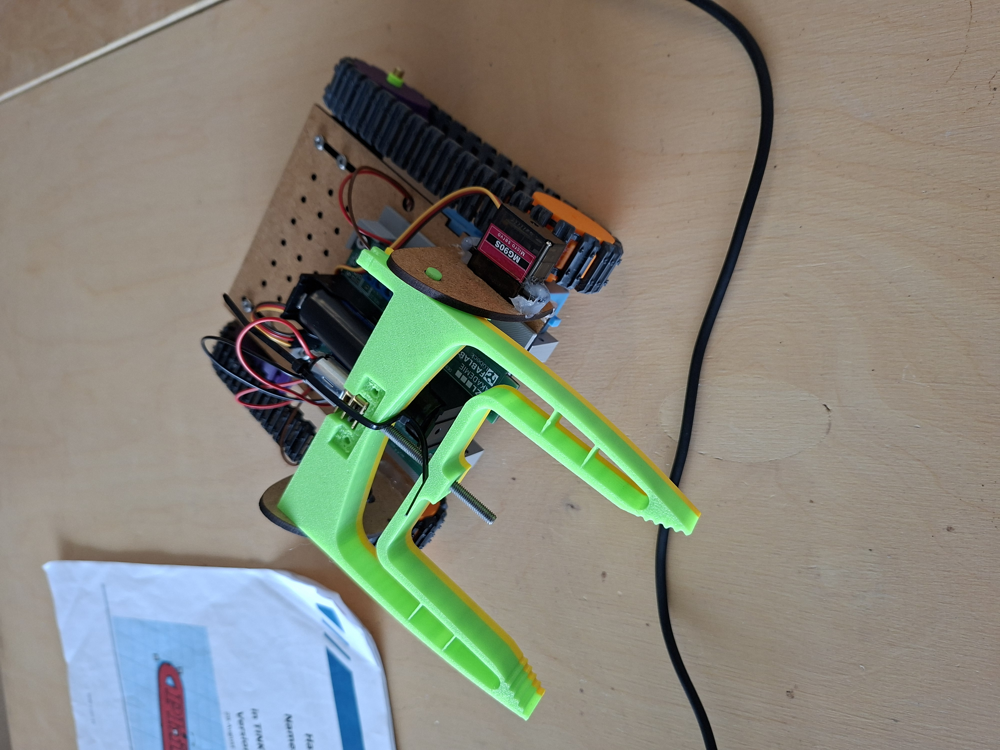

## Was ist der RescueBot?

Der RescueBot ist ein kettengetriebener Greifroboter. Er kann:

- fahren
- Gegenstände mit dem Frontgreifer aufnehmen
- den Greifer über eine Gewindespindel öffnen und schließen

Die Konstruktion kombiniert:

- gelaserte MDF-Teile
- 3D-gedruckte PLA-Teile
- TPU-Teile für Ketten und Abstandshalter

## Benötigte Bauteile

Vor dem Zusammenbau solltest du alle Teile bereitlegen und grob sortieren.

### Mechanische und elektrische Hauptteile

- 2 blaue Getriebemotoren für den Fahrantrieb
- 1 kleiner Getriebemotor mit M4-Gewinde für den Greifer
- 1 Servo für die Bewegung des Greifers
- 1 TinkerThinker-Platine
- 1 Akkuzelle / Batteriehalter
- MDF-Bodenplatte und zwei MDF-Seitenteile
- 3D-gedruckte Motorhalter, Achsenhalter, Räder und Greiferteile
- 2 TPU-Ketten
- Schrauben, Muttern und Abstandshalter
- optional Heißkleber für die Frontmontage

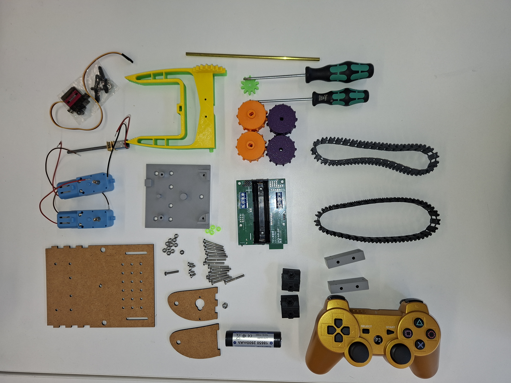

## Ordnerinhalt

- `RescueBot.jpg`: Foto des fertig aufgebauten Roboters
- `RescueBotCAD.f3d`: Fusion-360-Datei des Modells
- `RescueBotPictures/`: Schrittfotos für den Aufbau
- `ota/`: Dateien für Firmware/Flash-Prozesse

## Vor dem Start

Bevor du verschraubst:

- prüfe, ob alle 3D-Druckteile sauber entgratet sind
- teste, ob Schrauben und Muttern in die vorgesehenen Aussparungen passen
- richte die Bodenplatte so aus, dass die vielen Lochreihen oben liegen und die langen Schlitze links und rechts gut erreichbar sind

## Zusammenbau

Die Reihenfolge unten orientiert sich an den vorhandenen Bildern und ist so gewählt, dass sich später nichts unnötig wieder zerlegen muss.

### 1. Motorhalter an der Grundplatte montieren

Zuerst werden die gedruckten Halter an der Bodenplatte befestigt.

- Lege die MDF-Bodenplatte auf den Tisch.
- Setze die große gedruckte Trägerplatte auf die Unterseite beziehungsweise Rückseite der Bodenplatte.
- Schraube die Halter von unten durch die MDF-Platte fest.
- Nutze die vorgesehenen Mutternaufnahmen im gedruckten Teil, damit sich die Muttern beim Anziehen nicht mitdrehen.
- Ziehe die Schrauben nur so fest an, dass alles plan sitzt. Zu starkes Anziehen kann MDF und Druckteile verziehen.

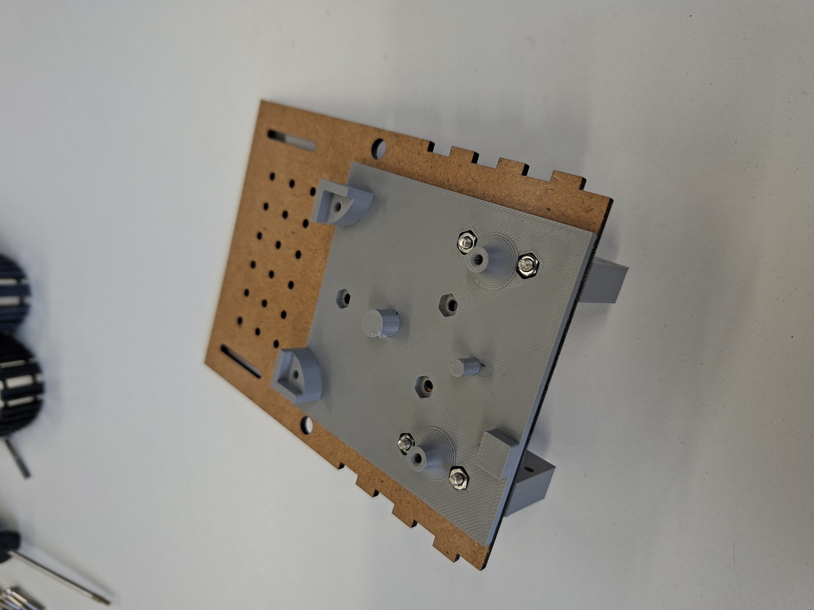
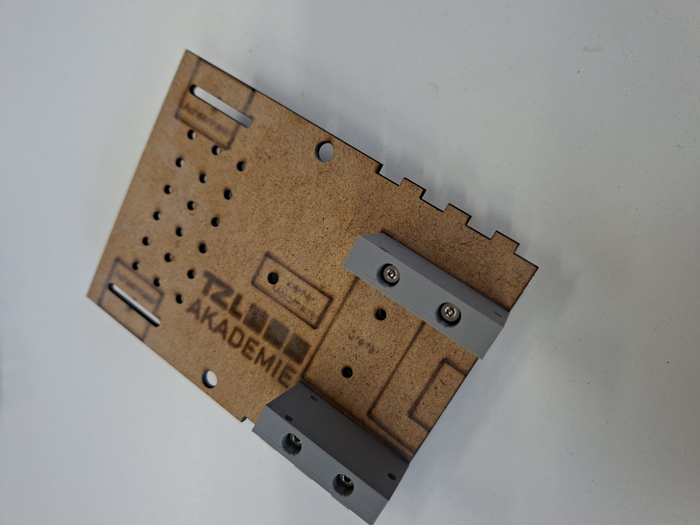

### 2. Fahrmotoren einsetzen

Jetzt werden die beiden blauen Fahrmotoren in die Halter eingesetzt.

- Setze jeden Motor in einen der vorgesehenen seitlichen Halter.
- Achte darauf, dass die Motorwellen nach außen zu den späteren Rädern zeigen.
- Richte beide Motoren parallel zueinander aus.
- Verschraube jeden Motor mit den vorgesehenen drei Schrauben im gedruckten Halter.
- Kontrolliere danach, ob sich beide Motoren fest anfühlen und nicht verkanten.

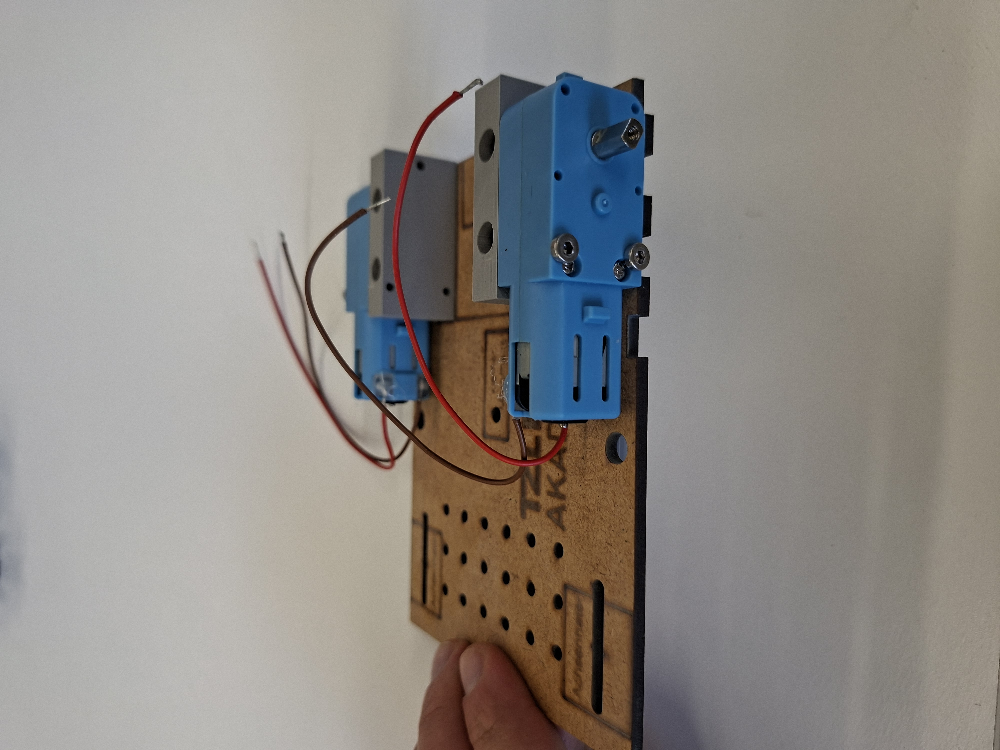
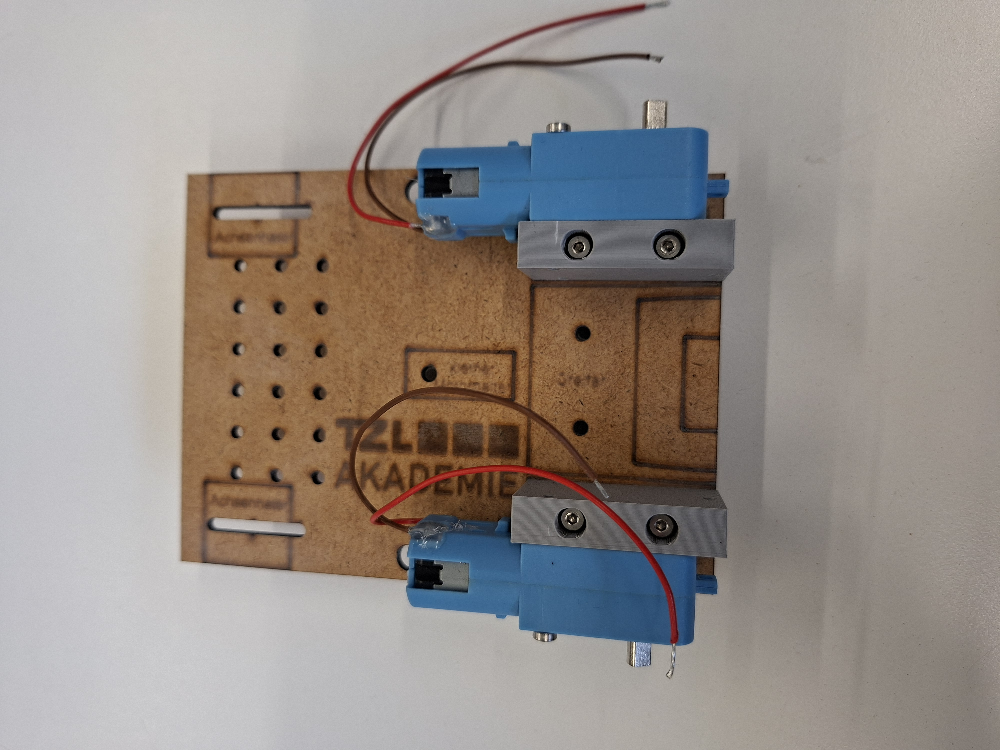

### 3. Achsenhalter montieren

Auf der gegenüberliegenden Seite der Räder sitzen freie Achsen, die in schwarzen Achsenhaltern laufen.

- Setze die Achsenhalter in die Langlöcher der Bodenplatte.
- Schraube sie so fest, dass sie noch leicht verschiebbar bleiben.
- Diese Langlöcher brauchst du später, um die Kettenspannung einzustellen.
- Prüfe, dass beide Halter auf einer Linie mit den Fahrmotoren sitzen.

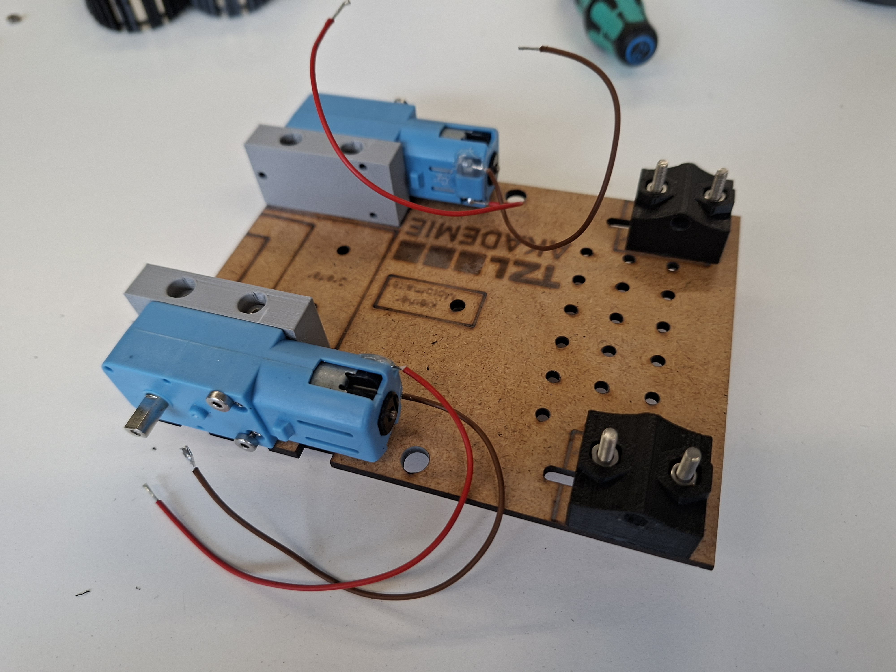
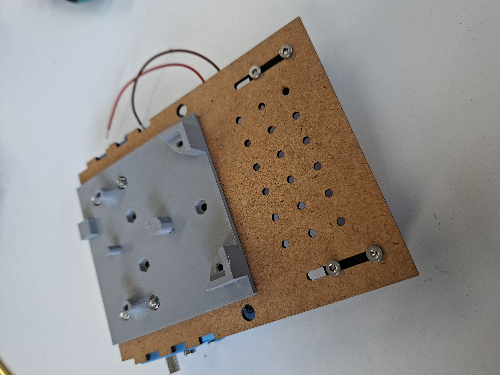

### 4. Räder und Achsen montieren

Jetzt entsteht das eigentliche Fahrwerk.

- Stecke die angetriebenen Räder auf die Wellen der beiden Fahrmotoren.
- Montiere die freien Räder auf die Metallachse.
- Setze die Achse durch beide Achsenhalter.
- Verwende die TPU-Abstandshalter, damit die Räder seitlich sauber geführt werden.
- Falls eine Bohrung zu stramm sitzt, arbeite sie nur minimal nach. Die Räder sollen sauber laufen, aber nicht wackeln.

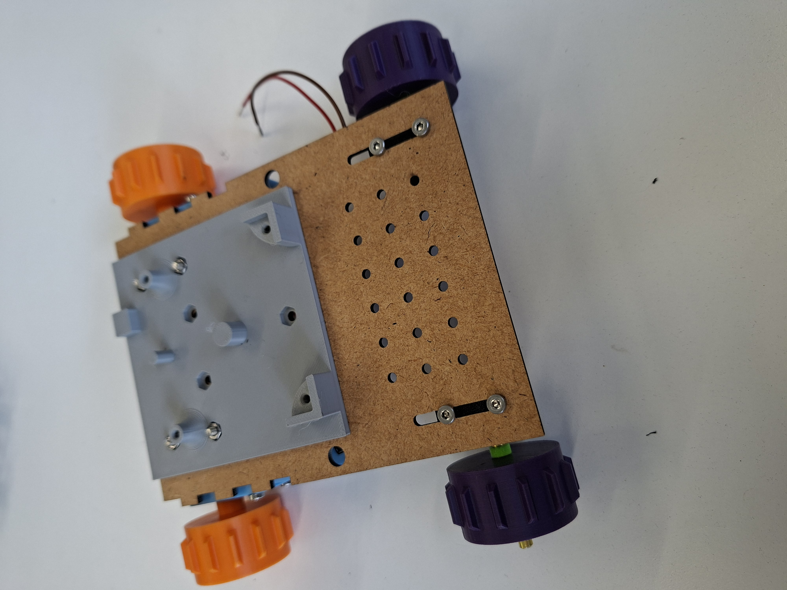
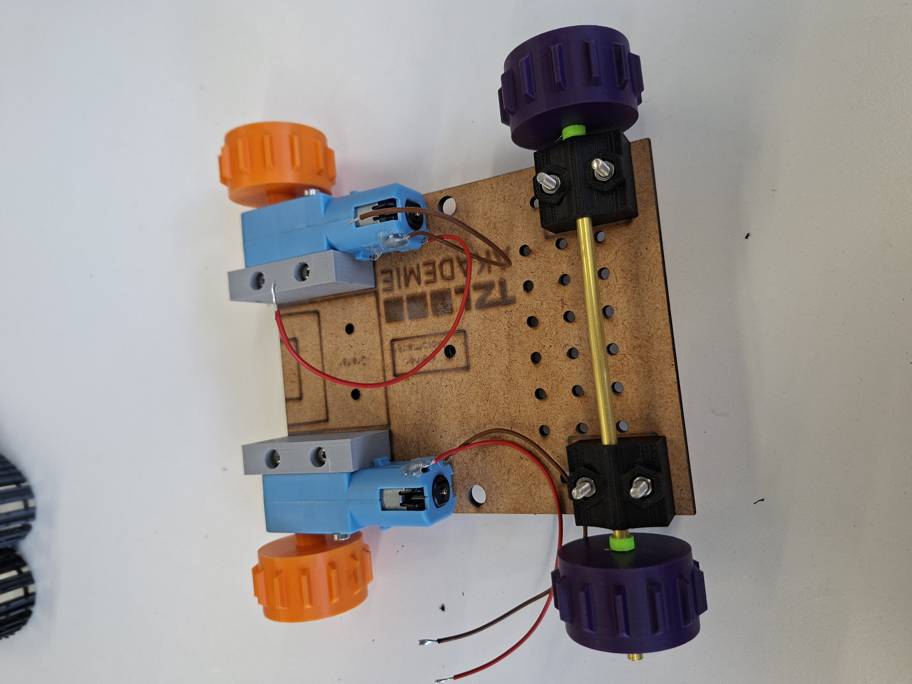

### 5. Ketten aufziehen und spannen

Wenn alle vier Räder sitzen, können die Ketten montiert werden.

- Ziehe pro Seite eine TPU-Kette über das vordere und hintere Rad.
- Verschiebe die Achsenhalter in den Langlöchern, bis die Kette straff sitzt.
- Die Kette soll nicht durchhängen, aber auch nicht so fest gespannt sein, dass die Räder schwergängig werden.
- Drehe die Räder von Hand durch und prüfe, ob die Kette sauber läuft.
- Ziehe die Schrauben der Achsenhalter erst dann endgültig fest.

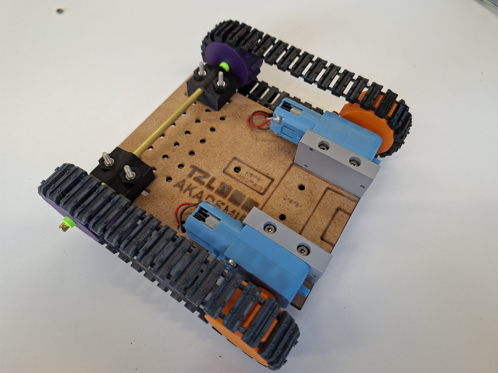

### 6. Greifer vormontieren

Der Greifer wird separat aufgebaut und danach vorne am Roboter befestigt.

- Lege die beiden gedruckten Greiferhälften bereit.
- Setze die M4-Mutter in die dafür vorgesehene Aufnahme im Greifer ein.
- Prüfe, ob die Mutter vollständig in ihrer Tasche sitzt.
- Führe die Gewindestange beziehungsweise die Motorschraube so ein, dass sie sauber mit der Mutter greift.
- Setze den kleinen Getriebemotor in die Halterung ein.
- Falls der Haltesteg absichtlich als Klemmteil ausgeführt ist, erwärme ihn vorsichtig und biege ihn nur so weit wie nötig.
- Prüfe am Ende von Hand, ob sich der Greifer über die Gewindespindel leicht öffnen und schließen lässt.

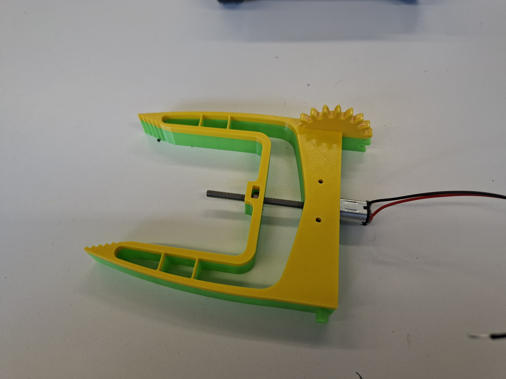
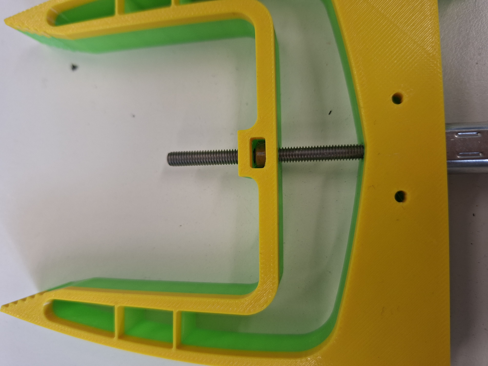

### 7. Servo und Frontteil montieren

Danach wird der Greifer mit dem Servo und den beiden MDF-Seitenteilen an der Front befestigt.

- Stecke den Servo mit montiertem Servo-Horn durch das MDF-Seitenteil.
- Führe die Spitze des Servo-Horns zuerst in die passende Aufnahme des Greifers.
- Richte den Greifer mittig zur Fahrzeugfront aus.
- Setze das zweite MDF-Seitenteil auf.
- Fixiere die Teile entweder mit den vorgesehenen Schrauben oder, wenn so vorgesehen, zusätzlich mit Heißkleber.
- Achte darauf, dass sich der Greifer frei bewegen kann und nicht an den MDF-Seitenteilen schleift.

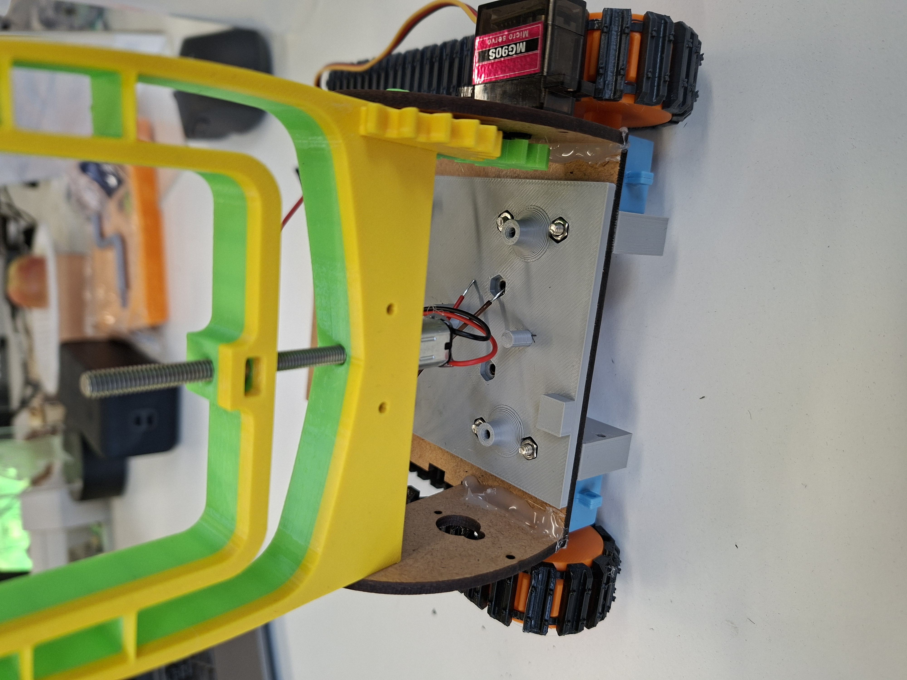
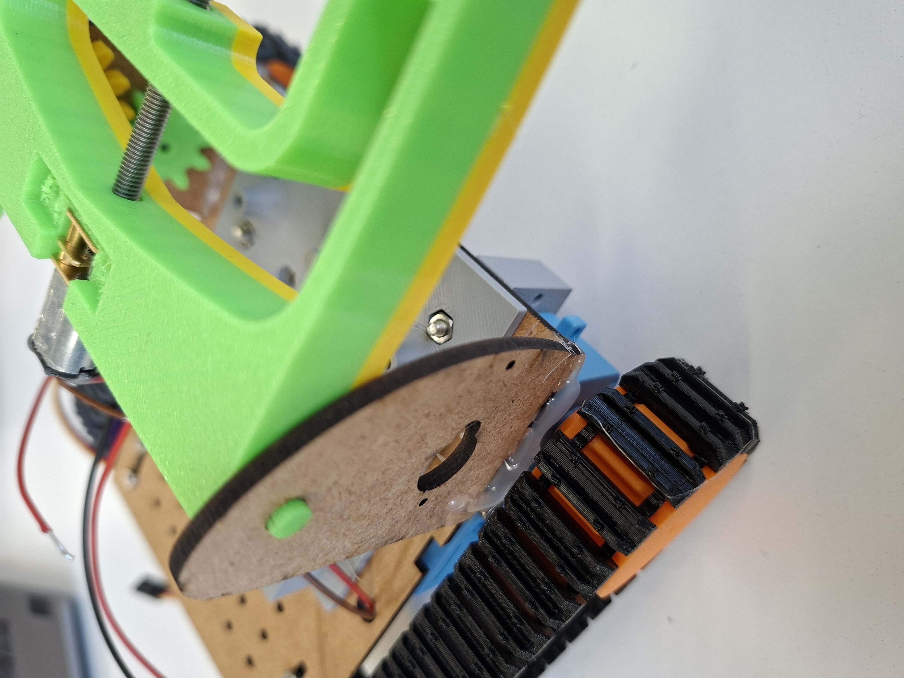
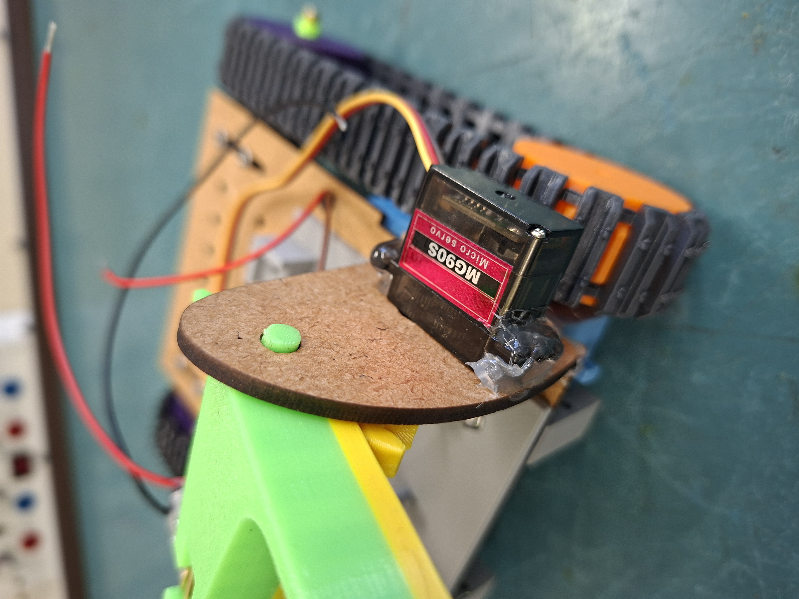

### 8. Endmontage von Platine, Akku und Verkabelung

Zum Schluss werden Elektronik und Leitungen sauber eingesetzt.

- Schraube die TinkerThinker-Platine auf den vorgesehenen Träger.
- Setze den Akku beziehungsweise den Batteriehalter ein.
- Verlege die Kabel so, dass sie nicht in die Ketten oder den Greifer geraten.
- Verbinde die beiden Fahrmotoren mit `C` und `D`.
- Verbinde den Greifermotor mit `A`.
- Stecke den Servo auf Anschluss `1`.
- Prüfe vor dem Einschalten noch einmal alle Schrauben, die Kettenspannung und die Kabelführung.

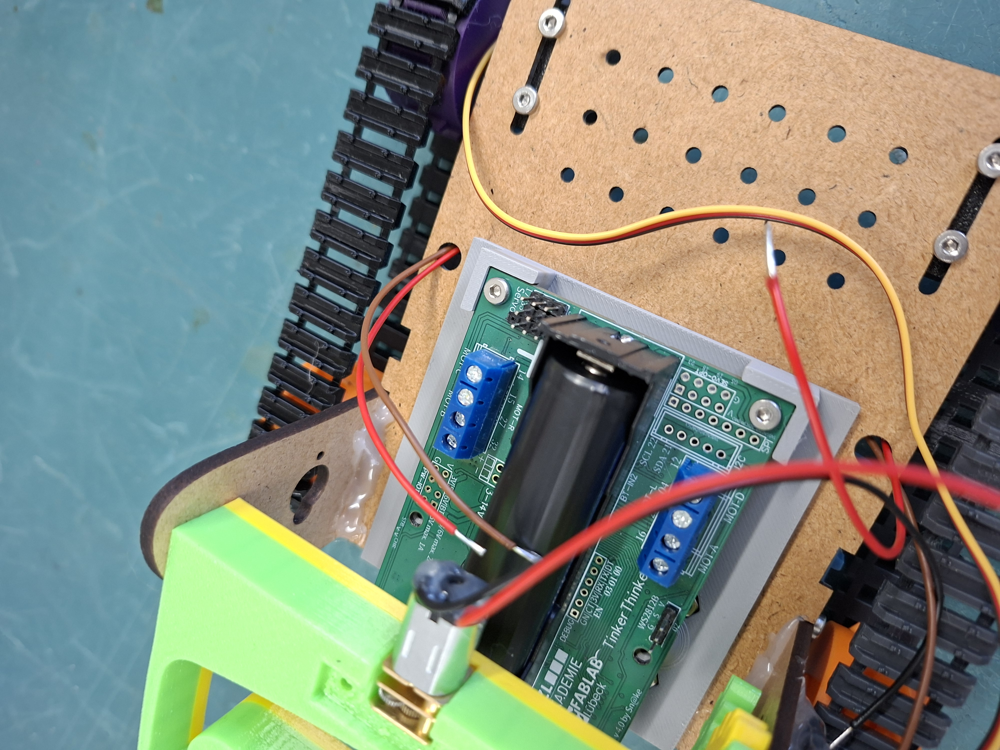

## Funktionsprüfung

Nach dem mechanischen Aufbau solltest du kurz testen:

- Drehen sich beide Ketten frei?
- Schleift keine Kette an Schrauben oder Haltern?
- Öffnet und schließt der Greifer sauber?
- Sitzt der Servo fest?
- Sind keine Kabel in beweglichen Bereichen?

## Tipps bei Problemen

- Kette springt ab: Achsenhalter etwas nachspannen und Radflucht prüfen.
- Rad läuft schwer: Abstandshalter und Bohrungen kontrollieren, Achse nicht verspannen.
- Greifer klemmt: Sitz der M4-Mutter und Ausrichtung der Gewindespindel prüfen.
- Front wackelt: Seitenteile und Servoaufnahme nachziehen oder sauber nachkleben.

## Software

Die Firmware für den RescueBot befindet sich in diesem Repository. Zum Bauen und Flashen solltest du die Hinweise im Projekt-Hauptverzeichnis beachten. Wenn die Weboberfläche verwendet wird, muss zusätzlich das LittleFS-Dateisystem hochgeladen werden.

## Elektrische Anschlüsse

Für die spätere Verkabelung gelten diese Anschlüsse:

- Anschluss `D` und `C`: Fahrmotoren
- Anschluss `A`: Greifermotor
- Anschluss `1`: Servo

## Lizenz

Dieses Projekt ist für freie, nicht-kommerzielle Nutzung gedacht. Eine kommerzielle Nutzung ist nicht vorgesehen.

## Kontakt

Fragen oder Hinweise bitte über das GitHub-Profil des Projekts oder per Mail an `gabrecht@tzl.de`.
